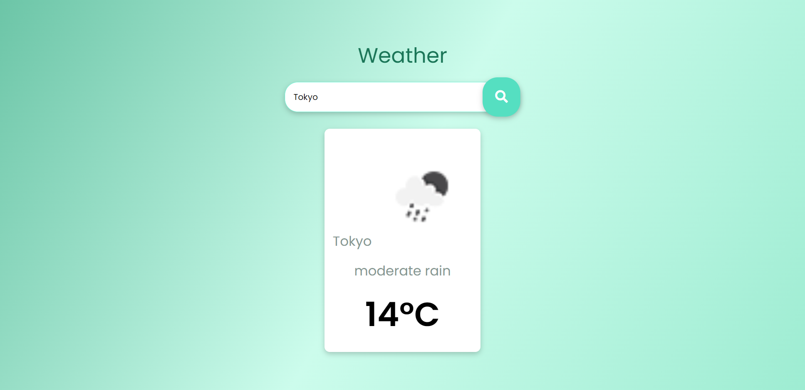

# Weather Page README

## Overview

This is a simple weather information web page that allows users to search for weather details by city or location. It provides real-time weather information, including the current temperature, weather conditions, and an icon representation of the weather.




## Features

- User-friendly interface with responsive design.
- Dynamic weather data retrieval based on user input.
- Stylish presentation of weather information with Font Awesome icons.
- Gradient background for a visually appealing experience.

## Technologies Used

- HTML5: Provides the structure of the web page.
- CSS3: Styles the page elements for a modern look.
- JavaScript: Adds interactivity to the page.
- Font Awesome: Used for weather icons.
- Google Fonts: Imports the "Poppins" font family for typography.

## Getting Started

To run this weather page locally, follow these steps:

1. Clone this repository to your local machine:

   ```bash
   git clone https://github.com/Xeven777/Weather.git
   ```
2. Open the project folder in your code editor.

3. Double-click on the index.html file to open it in your web browser.

4. Use the search input to enter a city or location, and click the search button to retrieve weather information.

## Customization
You can customize this weather page in various ways:

- Modify the CSS in style.css to change the page's appearance.
- Add additional functionality or features using JavaScript in script.js.
- Replace the default weather icon with a different one of your choice.
- Customize the font family and styles to match your design preferences.

## Credits
- Weather data is retrieved from a Openweather API.
- Icons are provided by Font Awesome.


## Author
[Anish](https://github.com/Xeven777)
